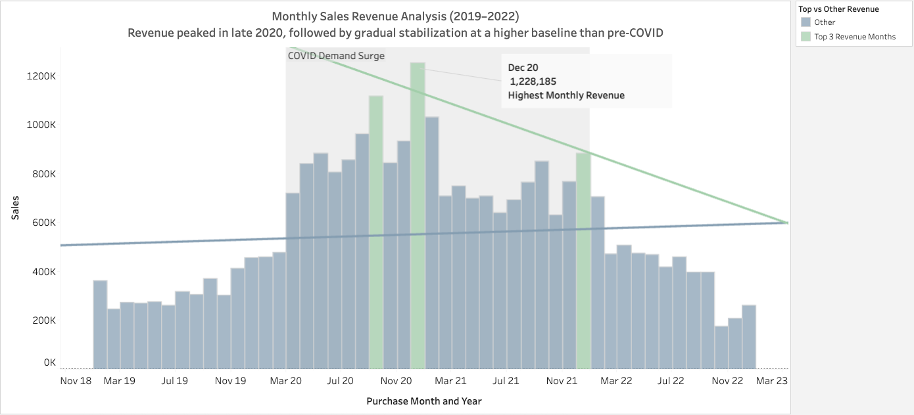
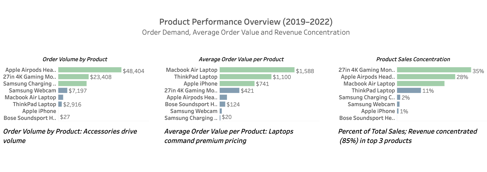
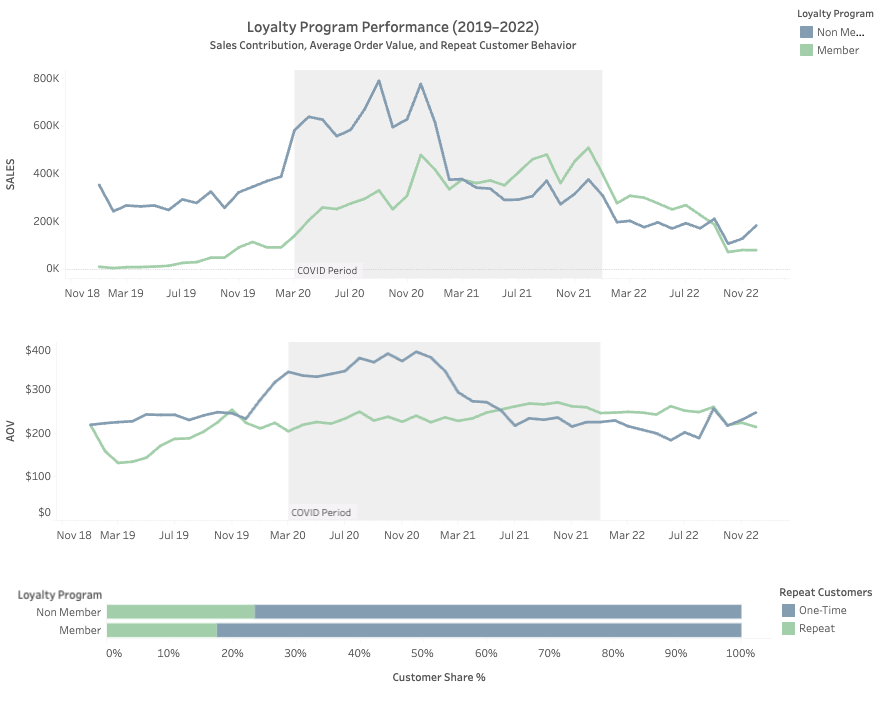
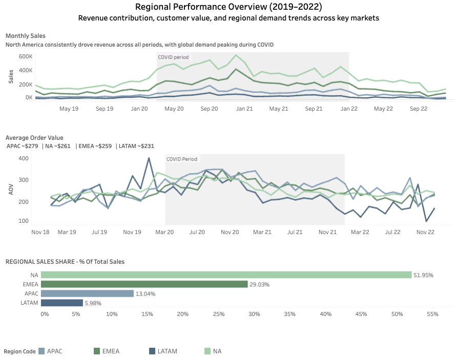

# Pulse-Technology-Analysis — Sales & Customer Analytics (2019–2022)

End-to-end **SQL and Tableau business intelligence analysis** evaluating revenue trends, customer behavior, product performance, refunds, and regional growth for a consumer electronics company navigating COVID-era demand shifts.

**Revenue surged during the COVID period and stabilized at a higher long-term baseline, but rising volatility and declining late-2022 order volume signal emerging demand contraction without new growth drivers.**

# Business Objective

Leadership requested a **data-driven performance review** to support preparation for a 2023 company-wide town hall, focusing on:
 Revenue trends before, during, and after COVID  
- Key growth drivers across products and regions  
- Loyalty program performance and retention behavior  
- Refund risk and customer value indicators  

- Revenue trends before, during, and after COVID  
- Key growth drivers across products and regions  
- Loyalty program performance and retention behavior  
- Refund risk and customer value indicators  

---
## Tools & Methods

- **SQL:** data cleaning, joins, aggregations, KPI analysis  
- **Tableau:** executive dashboard design and visualization  
- **Data Modeling:** relational schema with ERD validation  
- **Business Analysis:** revenue trends, AOV, loyalty impact, refund risk  

---

# Executive Summary

-  Revenue surged during COVID (peaking Q4 2020) and stabilized at a **higher post-COVID baseline**, indicating durable demand rather than temporary lift.  
- Revenue is concentrated in a **small number of top-performing products**, creating both growth leverage and concentration risk.  
- **Loyalty customers provide more stable repeat revenue**, reinforcing retention-focused strategy over short-term AOV gains.  

 

---

# Data Structure

Relational dataset composed of four core tables:

- `orders` — transactional purchases  
- `customers` — attributes and loyalty status  
- `order_status` — fulfillment and refund lifecycle  
- `geo_lookup` — country-to-region mapping  

An ERD illustrating table relationships is included below.

 
---

# Data Cleaning & Assumptions

Data quality issues were reviewed prior to analysis.  
Only **low-risk, clearly resolvable issues** were corrected.

**Actions included:**

- Standardizing inconsistent product names  
- Normalizing date formats  
- Replacing blank marketing channels with “Unknown”  
- Correcting region values using country codes  

Records lacking reliable source validation (e.g., zero prices, missing currency, anomalous timestamps) were **retained** due to minimal aggregate impact.

***Full issue log and resolutions are documented in the repository.***

---

# Key Insights & Findings

### Revenue Trends

**1. Pandemic-era demand created a structural revenue step-change**  
Revenue surged sharply during **2020**, peaking in **Q4 2020**, and later stabilized at a **higher baseline than pre-COVID levels**, indicating lasting revenue growth rather than a temporary spike.

**2. Growth momentum weakened through 2021–2022 despite elevated baseline**  
Quarterly performance showed **gradual deceleration** through **2021–2022**, signaling transition to stabilization-phase performance.

**3. Rising volatility and late-2022 decline signal emerging contraction risk**  
Order volume dropped sharply by **Q4 2022 (~-47%)**, suggesting softening demand and potential downside risk without new growth drivers.

 

###  2. Product Performance
### Key Product Performance Insights

**1. Revenue is concentrated in a small number of high-performing products**  
The **top three products** generate the majority of total revenue, indicating **revenue concentration risk** and reliance on a narrow group of top-performing products to sustain growth.

**2. Product categories play distinct roles in volume versus value generation**  
Accessories drive **highest order volume**, while laptops produce the **highest average order value (AOV)**, showing a structural split between **traffic drivers** and **revenue maximizers**.

**3. Category mix highlights opportunity for mid-tier expansion**  
Heavy reliance on premium and accessory extremes suggests potential to **expand mid-tier offerings** to balance **volume, margin stability, and risk exposure**.

 
 

###  3.Key Loyalty Program Insights

**1. Loyalty members contribute more stable long-term revenue despite a smaller customer base**  
Although representing a **smaller share of total customers**, the loyalty segment shows **more gradual revenue decline following the COVID peak**, indicating stronger **retention stability and lifecycle value**.

**2. Repeat purchase behavior is comparable across loyalty and non-loyalty customers**  
Customer share analysis shows **similar repeat proportions** between members and non-members, suggesting the program’s primary impact is **revenue consistency and engagement stability**, rather than materially higher repeat frequency.

**3. Converging AOV trends reinforce retention—not basket size—as the core loyalty driver**  
The **average order value gap narrows over time** as non-member AOV declines post-COVID, indicating loyalty value is driven by **sustained engagement and revenue resilience**, not increased per-order spend.

 
 
###  4. Regional Performance Insights
 
 
* North America is the primary revenue driver, contributing ~52% of total sales and consistently leading monthly revenue across all periods.
Global demand surged during COVID, with all regions showing a noticeable lift, though North America experienced the strongest absolute growth.

* APAC demonstrates the highest average order value (~$279), despite contributing a smaller share of total revenue, indicating higher-value purchases but lower order volume.
* EMEA represents a meaningful secondary market, accounting for ~29% of total sales with relatively stable AOV trends.
* LATAM remains a smaller growth opportunity, contributing ~6% of total sales with the lowest average order value among regions.  

### 5. Refunds & Risk
 
 
* Refund rates are highest for premium laptop products, indicating higher per-order risk.

* High-volume accessories generate more refunds in absolute terms but lower refund rates.

* Refund risk is driven by product type rather than order volume alone.

# Business Recommendations

* Diversify revenue drivers by expanding mid-tier products to reduce reliance on top SKUs.

* Continue investing in the loyalty program, focusing on retention and lifecycle value rather than short-term AOV lift.

* Monitor premium product refunds to reduce high-value loss exposure.

* Strengthen regional growth strategies outside North America, particularly in EMEA and APAC.

# Repository Contents

* noemile8240/ Pulse_Technology /sql/ — Data cleaning & analysis queries

* noemile8240/ Pulse_Technology /tableau/ — Dashboard screenshots

* noemile8240/ Pulse_Technology /images/ — ERD and visual assets

* noemile8240/ Pulse_Technology README.md — Project documentation

🔗 Tableau Dashboard

👉 [Link to Tableau Public Dashboard]
