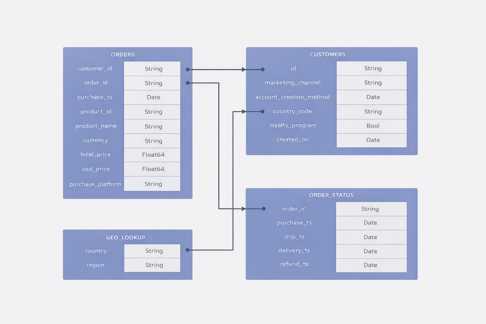

# Pulse-Technology-Analysis
SQL and Tableau analytics project analyzing revenue trends, product performance, loyalty behavior, refunds, and regional growth for a consumer electronics company (2019–2022).

# Pulse Technology — Sales & Customer Analytics (2019–2022)
## Project Overview

Pulse Technology is a fictitious consumer electronics company specializing in monitors, laptops, headphones, and accessories. Launched shortly before the COVID-19 pandemic, the company experienced rapid demand shifts, changing customer behavior, and evolving revenue patterns.

This project analyzes Pulse Technology’s sales performance from 2019–2022, with a focus on revenue trends, product performance, loyalty program impact, refunds, and regional demand. The analysis was conducted to support leadership preparation for a company-wide town hall in 2023.

## Stakeholder Request

Leadership requested a data-driven walkthrough of historical performance to answer:

* How did overall sales trend before, during, and after COVID?

* What were the key growth patterns over time?

* How is the loyalty program performing?

* Which products and regions drive the most revenue?

* What do refund rates and AOV reveal about risk and customer behavior?

## Executive Summary

Revenue surged sharply during the COVID period, peaking in late 2020, followed by normalization at a higher baseline than pre-pandemic levels. Growth slowed through 2022, indicating demand stabilization rather than collapse.

Revenue is highly concentrated in a small set of high-performing products, while loyalty customers contribute more stable revenue and higher repeat purchase behavior over time. Regional performance shows North America as the primary revenue driver, with meaningful contributions from EMEA and APAC.

## Data Structure

The analysis was modeled as a relational dataset consisting of four core tables:

* orders — transactional purchase data

* customers — customer attributes and loyalty status

* order_status — shipping, delivery, and refund timestamps

* geo_lookup — country-to-region mapping

 An ERD is included in this repository to illustrate table relationships.
 

🧹 Data Cleaning & Assumptions

Data quality issues were reviewed and logged prior to analysis. Only issues with a clear resolution and minimal business risk were addressed.

Actions taken included:

Standardizing inconsistent product naming

Normalizing date formats

Replacing blank marketing channels with “Unknown”

Correcting invalid or missing region values where country codes were known

No action was taken on records lacking a reliable source of truth (e.g., zero-dollar prices, missing currencies, or anomalous timestamps) due to their minimal impact on aggregate results.

📌 Full issue log and resolutions are documented in the repository.

📈 Key Insights & Findings
1️⃣ Revenue Trends & Growth

Revenue peaked in Q4 2020 during COVID demand surge.

Post-COVID revenue stabilized at a higher baseline than pre-pandemic levels.

Quarterly analysis revealed a gradual deceleration through 2022, consistent with demand normalization.

2️⃣ Product Performance

Accessories (e.g., AirPods, monitors) drive order volume.

Laptops command the highest Average Order Value.

The top three products account for the majority of total revenue, indicating revenue concentration risk.

3️⃣ Loyalty Program Performance

Loyalty members represent a smaller share of customers but show higher repeat purchase behavior.

Loyalty revenue proved more stable post-COVID compared to non-member sales.

AOV differences narrowed over time, suggesting loyalty benefits retention more than basket size.

4️⃣ Refunds & Risk

Refund rates are highest for premium laptop products, indicating higher per-order risk.

High-volume accessories generate more refunds in absolute terms but lower refund rates.

Refund risk is driven by product type rather than order volume alone.

💡 Business Recommendations

Diversify revenue drivers by expanding mid-tier products to reduce reliance on top SKUs.

Continue investing in the loyalty program, focusing on retention and lifecycle value rather than short-term AOV lift.

Monitor premium product refunds to reduce high-value loss exposure.

Strengthen regional growth strategies outside North America, particularly in EMEA and APAC.

🛠️ Tools & Skills Demonstrated

SQL (BigQuery): data cleaning, aggregation, KPI calculations

Tableau: dashboard design, trend analysis, cohort comparison

Analytics: stakeholder framing, executive storytelling, business recommendations

Data Quality: issue logging, assumptions, and impact assessment

📂 Repository Contents

/sql/ — Data cleaning & analysis queries

/tableau/ — Dashboard screenshots

/images/ — ERD and visual assets

README.md — Project documentation

🔗 Tableau Dashboard

👉 [Link to Tableau Public Dashboard]
