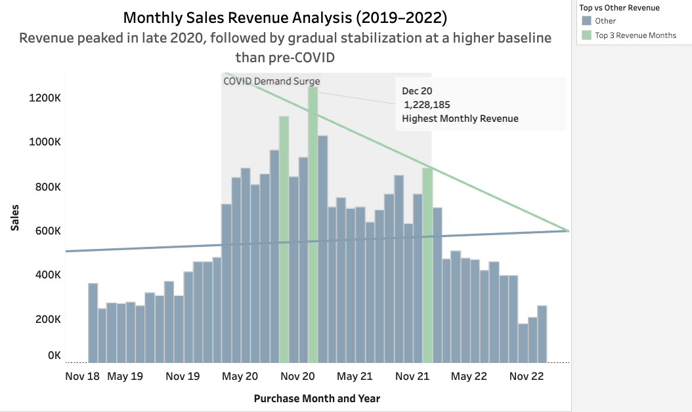
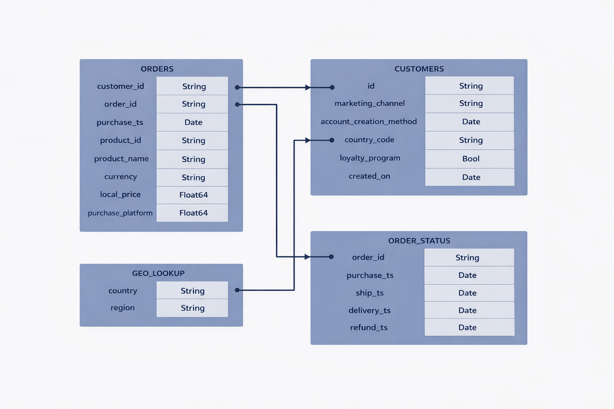
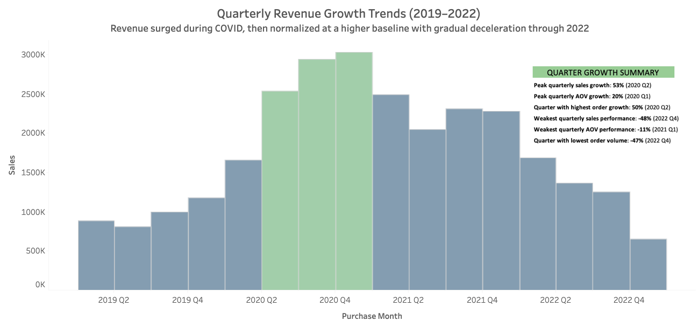
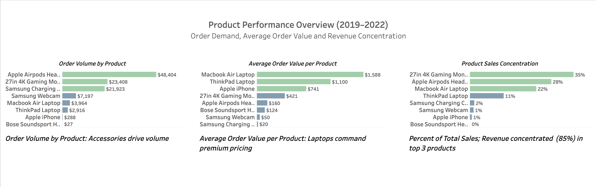
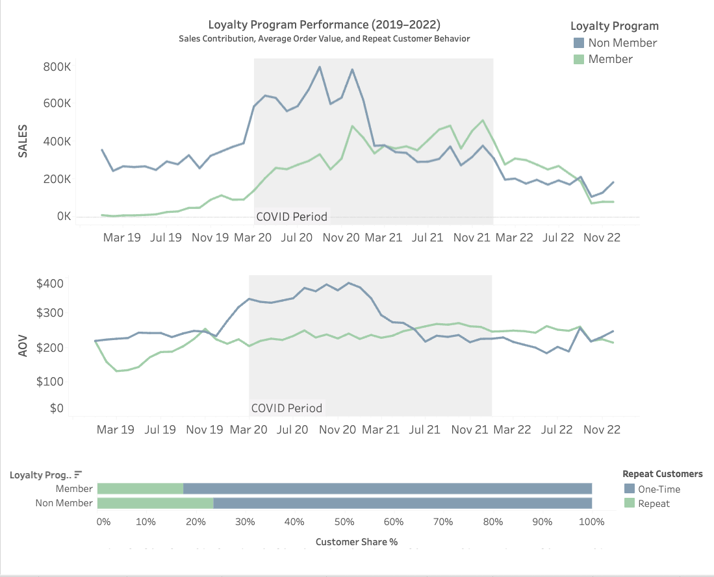
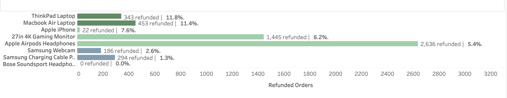

# Pulse-Technology-Analysis — Sales & Customer Analytics (2019–2022)

End-to-end **SQL and Tableau data analysis** evaluating revenue trends, customer behavior, product performance, refunds, and regional growth for a consumer electronics company navigating COVID-era demand shifts.

**Revenue surged during the COVID period and stabilized at a higher long-term baseline, but rising volatility and declining late-2022 order volume signal emerging demand contraction without new growth drivers.**

# Business Objective

Leadership requested a **data-driven performance review** to support preparation for a 2023 company-wide town hall, focusing on:  
- Revenue trends before, during, and after COVID  
- Key growth drivers across products and regions  
- Loyalty program performance and retention behavior  
- Refund risk and customer value indicators  

- Revenue trends before, during, and after COVID  
- Key growth drivers across products and regions  
- Loyalty program performance and retention behavior  
- Refund risk and customer value indicators  

---
## Tools & Methods

- **SQL:** data cleaning, joins, aggregations, KPI analysis  
- **Tableau:** executive dashboard design and visualization  
- **Data Modeling:** relational schema with ERD validation  
- **Business Analysis:** revenue trends, AOV, loyalty impact, refund risk  

---

# Executive Summary
- Revenue surged during COVID (peaking Q4 2020) and stabilized at a **higher post-COVID baseline**, indicating durable demand rather than temporary lift.  
- Revenue is concentrated in a **small number of top-performing products**, creating both growth leverage and concentration risk.
- **Loyalty customers contribute more stable long-term revenue despite similar repeat rates**, reinforcing a retention-focused strategy over short-term AOV expansion.
 

---

# Data Structure

Relational dataset composed of four core tables:

- `orders` — transactional purchases  
- `customers` — attributes and loyalty status  
- `order_status` — fulfillment and refund lifecycle  
- `geo_lookup` — country-to-region mapping  

An ERD illustrating table relationships is included below.

 

---

# Data Cleaning & Assumptions

Data quality issues were reviewed prior to analysis.  
Only low-risk, clearly resolvable issues were corrected.

**Actions included:**

- Standardizing inconsistent product names  
- Normalizing date formats  
- Replacing blank marketing channels with “Unknown”  
- Correcting region values using country codes  

Records lacking reliable source validation (e.g., zero prices, missing currency, anomalous timestamps) were **retained** due to minimal aggregate impact.

***Full issue log and resolutions are documented in the repository.***

---

# Key Insights & Findings
### 1. Revenue Trends and Growth
- **Pandemic-era demand created a structural revenue step-change**  
Revenue surged sharply during 2020, peaking in Q4 2020, and later stabilized at a higher baseline than pre-COVID levels, indicating lasting revenue growth rather than a temporary spike.

- **Growth momentum weakened through 2021–2022 despite elevated baseline**  
Quarterly performance showed gradual deceleration through 2021–2022, signaling transition to stabilization-phase performance.

- **Rising volatility and late-2022 decline signal emerging contraction risk**  
Order volume dropped sharply by Q4 2022 (~-47%), suggesting softening demand and potential downside risk without new growth drivers.

 

---

###  2. Key Product Performance Insights
- **Revenue is concentrated in a small number of high-performing products**  
The top three products generate the majority of total revenue, indicating revenue concentration risk and reliance on a narrow group of top-performing products to sustain growth.

- **Product categories play distinct roles in volume versus value generation**  
Accessories drive highest order volume, while laptops produce the highest average order value (AOV), showing a structural split between traffic drivers and revenue maximizers.

- **Category mix highlights opportunity for mid-tier expansion**  
Heavy reliance on premium and accessory extremes suggests potential to expand mid-tier offerings to balance volume, margin stability, and risk exposure.

 
 
 ---

###  3. Key Loyalty Program Insights

- **Loyalty members contribute more stable long-term revenue despite a smaller customer base**  
Although representing a smaller share of total customers, the loyalty segment shows more gradual revenue decline following the COVID peak, indicating stronger retention stability and lifecycle value.

- **Repeat purchase behavior is comparable across loyalty and non-loyalty customers**  
Customer share analysis shows similar repeat proportions between members and non-members, suggesting the program’s primary impact is revenue consistency and engagement stability, rather than materially higher repeat frequency.

- **Converging AOV trends reinforce retention—not basket size—as the core loyalty driver**  
The average order value gap narrows over time as non-member AOV declines post-COVID, indicating loyalty value is driven by sustained engagement and revenue resilience, not increased per-order spend.

 
 
 ---
  
###  4. Key Regional Performance Insights

- **North America remains the dominant and structurally resilient revenue driver**  
North America contributes ~52% of total sales and leads monthly revenue across all periods, with the largest absolute surge during COVID and sustained post-pandemic scale, reinforcing its role as the company’s primary revenue engine.

- **APAC delivers the highest customer value despite lower overall revenue share**  
APAC records the highest average order value (~$279) while contributing a smaller portion of total sales, indicating a high-value but lower-volume customer base with potential for scalable growth.

- **EMEA provides stable secondary scale while LATAM represents early-stage expansion potential**  
EMEA contributes ~29% of total sales with relatively consistent AOV trends, positioning it as the strongest secondary market, whereas LATAM’s 6% share and lowest AOV ($231) indicate a developing region with long-term growth opportunity.

 
 
 ---
 
### 5. Key Refunds & Risk Insights

- **Premium laptops carry the highest per-order refund risk**
ThinkPad and MacBook Air models show the highest refund rates (~11–12%), indicating elevated per-transaction risk associated with higher-value products.

- **High-volume accessories drive refund counts but not refund severity** 
Products such as AirPods and 27” monitors generate the largest number of refunds in absolute terms while maintaining moderate refund rates (~5–6%), reflecting scale rather than disproportionate risk.

- **Refund exposure is driven by product category rather than sales volume alone**
The contrast between high-rate laptops and high-volume accessories demonstrates that refund risk is primarily product-type dependent, highlighting the need for category-specific quality and return-prevention strategies.

  
 
 ---
 
# Business Recommendations

- **Diversify revenue drivers by expanding mid-tier product offerings**  
  Reducing reliance on a small group of top-performing products can improve revenue resilience, margin stability, and long-term growth balance.
- **Introduce targeted product bundling to bridge volume and value dynamics** 
  Pairing high-volume accessories with premium products through bundled offers or incentive pricing can increase average order value, cross-category attachment, and overall revenue efficiency.

- **Continue investing in the loyalty program with a retention-first strategy**  
  Prioritize customer lifecycle value and revenue stability rather than short-term AOV expansion to strengthen sustainable performance.

- **Reduce high-value refund exposure in premium product categories**  
  Focus on quality control, return-prevention initiatives, and post-purchase support for premium laptops where per-order refund risk is highest.

- **Balance core-market growth in North America with international expansion**  
  Strengthening product depth, promotions, and engagement in North America can drive near-term revenue gains given its ~52% share, while continued investment in EMEA and APAC reduces concentration risk and enables scalable long-term growth.
 
 ---
 

# Repository Contents

* [noemile8240/ Pulse_Technology /EXCEL Docs/ — Pulse Raw data file and Issue Log](Excel_Files)
  
* [noemile8240/ Pulse_Technology /images/ — Graphs and visual assets](Images)

* [noemile8240/ Pulse_Technology README.md — Project documentation](README.md)
    
* [noemile8240/ Pulse_Technology /sql/ — Data cleaning & analysis queries](SQL)

